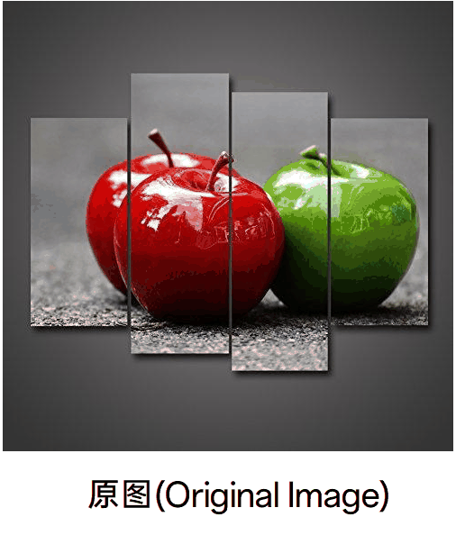
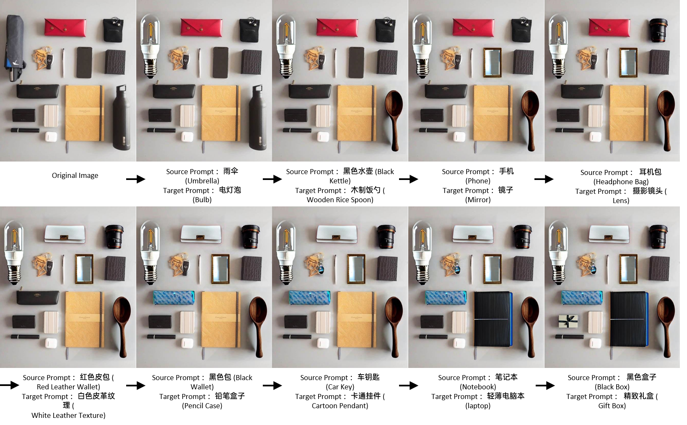
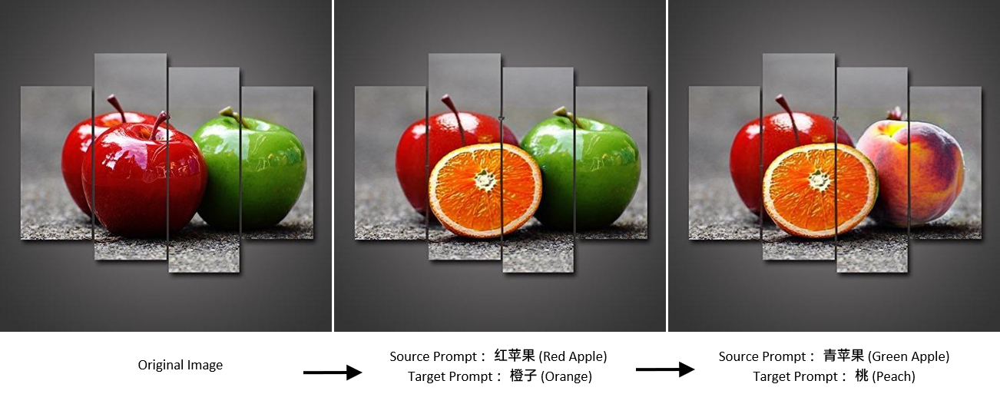

# Edit Everything: A Text-Guided Generative System for Images Editing


[Defeng Xie](xiedefeng@oppo.com), [Ruichen Wang](wangruichen@oppo.com),[Jian Ma](majian2@oppo.com),[Chen Chen](chenchen4@oppo.com),[Haonan Lu](luhaonan@oppo.com),[Dong Yang](dongyang3-c@my.cityu.edu.hk),[Fobo Shi](foboshi99@gmail.com),[Xiaodong Lin](lin@business.rutgers.edu)   
**OPPO Research Institute**

> <font size=5> "While drawing I discover what I realy want to say" --Dario Fo </font>

We propose a text-guided generative system without any finetuning (zero-shot). We achieve a great performance for image editing by the implement of [Segment Anything Model](https://github.com/facebookresearch/segment-anything)+[CLIP](https://github.com/openai/CLIP)+[Stable Diffusion](https://github.com/Stability-AI/stablediffusion). This work firstly provides an efficient solution for Chinese scenarios. 

This is the implement of [Edit Everything: A Text-Guided Generative System for Images Editing](https://arxiv.org/abs/2304.14006)


<div align=center>

</div> 


<!-- <div align=center>  </div>

<div align=center> 

<div align=center> 

<div align=center> .gif) -->
**Approach**

The text-guided generative system consists of [Segment Anything Model (SAM)](https://github.com/facebookresearch/segment-anything), [CLIP](https://github.com/openai/CLIP), and [Stable Diffusion (SD)](https://github.com/Stability-AI/stablediffusion). First, we obtain all segments of an image by SAM. Second, based on the **source prompt**,  we rerank these segments and find the target segment with the highest score calculated by our CLIP. The **source prompt** is a text which describes an object of an image. Finally, we write a **target prompt** to guide our Stable Diffusion to generate a new object to replace the detected area. 

<div align=center>
 


</div> 

For Chinese scenarios, our CLIP is pre-trained on Chinese corpus and image pairs. And Stable Diffusion is also pre-trained on Chinese corpus. So our work first achieves the text-guided generative system in Chinese scenarios. For English scenarios, we just implement open-source [CLIP](https://github.com/openai/CLIP) and [Stable Diffusion](https://github.com/Stability-AI/stablediffusion).

*Note:  In this demo, we use [Taiyi-CLIP-Roberta-large-326M-Chinese](Taiyi-CLIP-Roberta-large-326M-Chinese) and   [stable-diffusion-inpainting](https://huggingface.co/runwayml/stable-diffusion-inpainting). Thus the target-prompt should be english input rather than chinese. real examples of this demo are slightly different from those shown in the README. we present a comparison between our trained models and open-source models*.

<div align=center>
 
</div> 


**Getting Started**

PyTorch 1.10.1 (or later) and python 3.8 are recommended. Some python packages are needed and you can find the install instruct in demo.ipynb
```
pip install -r requirements.txt
```
For CLIP, download the checkpoint of [Taiyi-CLIP-Roberta-large-326M-Chinese](https://huggingface.co/IDEA-CCNL/Taiyi-CLIP-Roberta-large-326M-Chinese) and [clip-vit-large-patch14](https://huggingface.co/openai/clip-vit-large-patch14/tree/main) in [CLIP](https://github.com/openai/CLIP),and replace the checkpoint path in clip_wrapper.py.
For SAM, download the checkpoint of [vit_l](https://github.com/facebookresearch/segment-anything) and replace the checkpoint path in segmentanything_wrapper.py.
for SD, download the checkpoint of [stable-diffusion-inpainting](https://huggingface.co/runwayml/stable-diffusion-inpainting) and replace the checkpoint path in stablediffusion_wrapper.py. 
Final, see the demo.ipynb to use each module.

**More Example**

One object can be edited at a time

<div align=center>


</div> 

<!-- 


 -->


Multiple objects of an image are edited step by step






**Next to do**

we will further improve zero-shot performances in our system. In the future, we will add area-guided and point-guided tools.

